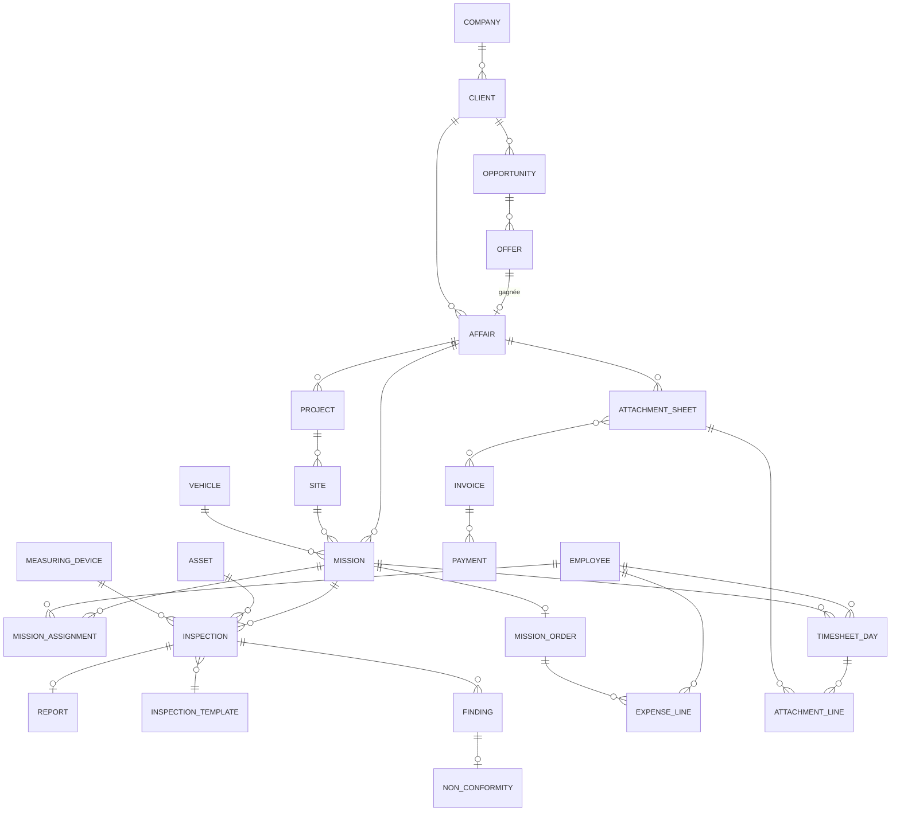

# 03 — Modèle de données & ERD

Toutes les tables portent : `id` (UUID v7), `companyId`, `createdAt`, `updatedAt`, `createdById`, `updatedById`, `deletedAt` (suppression logique). Les tables analytiques portent en plus `affairId` dès que l'imputation a un sens.

---

## 1. Vue d'ensemble — la colonne vertébrale analytique



---

## 2. Socle & sécurité

| Table | Champs clés | Notes |
|---|---|---|
| `Company` | `code`, `name`, `legalId (ICE)`, `logo`, `address`, `vatRate`, `currency` | I2S TESTING, I2S TESTING SUD, BETA ENG |
| `User` | `email`, `passwordHash`, `employeeId`, `isActive`, `mfaSecret`, `lastLoginAt` | 1 utilisateur ↔ 0..1 employé |
| `Role` | `code`, `name`, `isSystem` | 12 rôles du CDC |
| `Permission` | `resource`, `action` | 7 verbes : `view create update delete approve export download` |
| `RolePermission` | `roleId`, `permissionId`, `scope` | `scope ∈ {all, company, department, team, own}` |
| `UserRole` | `userId`, `roleId`, `companyId`, `departmentId` | Habilitation contextuelle |
| `AuditLog` | `entity`, `entityId`, `action`, `before`, `after`, `userId`, `ip`, `at` | Append-only |
| `Notification` | `userId`, `type`, `payload`, `readAt`, `channels` | in-app / e-mail / push |
| `NumberSequence` | `companyId`, `scope`, `year`, `next`, `pattern` | Génère `26/0142`, `OM-26-0311`… |
| `Setting` | `companyId`, `key`, `value (JSONB)` | Barèmes, plafonds, calendrier ouvré |
| `Department` | `code`, `name`, `managerId` | CND, CTC, EILM, HSE, Direction, Support |

---

## 3. Commercial

| Table | Champs clés |
|---|---|
| `Client` | `code`, `name`, `ice`, `type (client/prospect)`, `sector`, `address`, `paymentTerms`, `creditLimit`, `ownerId` |
| `Contact` | `clientId`, `name`, `role`, `email`, `phone`, `isPrimary` |
| `Opportunity` | `clientId`, `title`, `stage`, `amount`, `probability`, `expectedCloseDate`, `ownerId`, `departmentId`, `lostReason` |
| `Tender` (appel d'offres) | `opportunityId`, `reference`, `publisher`, `submissionDeadline`, `openingDate`, `guaranteeAmount`, `status` |
| `Offer` | `opportunityId`, `number`, `version`, `amountHT`, `validUntil`, `status`, `sentAt`, `documentId` |
| `OfferLine` | `offerId`, `designation`, `unit (vacation/forfait/ml…)`, `quantity`, `unitPrice`, `amount` |
| `FollowUp` (relance) | `opportunityId`, `date`, `channel`, `contactId`, `outcome`, `nextActionDate`, `userId` |

**Pipeline** : `Nouveau → Consultation → Offre en préparation → Offre envoyée → Relance → Négociation → Gagné | Perdu`.

---

## 4. Affaires & projets

| Table | Champs clés |
|---|---|
| `Affair` | `number (AA/XXXX)`, `clientId`, `offerId`, `title`, `departmentId`, `accountManagerId`, `contractAmountHT`, `budgetAmount`, `dailyRate (vacation journalière)`, `startDate`, `endDate`, `status`, `riskFlag` |
| `AffairBudgetLine` | `affairId`, `category (MO/matériel/sous-traitance/frais/véhicule)`, `plannedAmount` |
| `Project` | `affairId`, `code`, `name`, `manager`, `startDate`, `endDate`, `status` |
| `Site` | `projectId`, `name`, `address`, `city`, `region`, `latitude`, `longitude`, `accessConstraints`, `hseRequirements`, `distanceFromHqKm` |
| `AffairRate` | `affairId`, `serviceType`, `unit`, `unitPrice`, `validFrom` | grille tarifaire par affaire |

`Affair.status` : `Prospect → En cours → Suspendue → Terminée → Clôturée → Annulée`.
`distanceFromHqKm` alimente automatiquement le contrôle de l'indemnité de déplacement (> 150 km).

---

## 5. Missions & ordres de mission

| Table | Champs clés |
|---|---|
| `Mission` | `number`, `affairId`, `projectId`, `siteId`, `departmentId`, `serviceType`, `plannedStartDate`, `plannedEndDate`, `actualStartDate`, `actualEndDate`, `reportDueDate`, `reportDeliveredDate`, `vehicleId`, `requestedById`, `status`, `billable` |
| `MissionAssignment` | `missionId`, `employeeId`, `role (lead/assistant)`, `plannedDays`, `actualDays`, `dailyCostSnapshot` |
| `MissionOrder` (OM) | `number`, `missionId`, `object`, `instructions`, `hseInstructions`, `status`, `issuedById`, `signedById`, `signedAt`, `signatureHash`, `pdfDocumentId` |
| `MissionOrderApproval` | `missionOrderId`, `step`, `userId`, `decision`, `comment`, `at` |

Les 4 dates (`plannedStart`, `actualStart`, `reportDue`, `reportDelivered`) sont la base des KPI qualité QMS.
`dailyCostSnapshot` fige le coût journalier au moment de l'affectation — garantit la reproductibilité des marges.

---

## 6. Inspections, templates & rapports

### 6.1 Le moteur de templates

| Table | Champs clés |
|---|---|
| `InspectionMethod` | `code (UT/PT/MT/VT/RT/…)`, `name`, `departmentId`, `standards[]` |
| `InspectionTemplate` | `formCode (PR01-F02)`, `title`, `titleEn`, `methodId`, `version`, `applicationDate`, `paradigm`, `schema (JSONB)`, `pdfLayout (JSONB)`, `isActive` |
| `Inspection` | `missionId`, `templateId`, `templateVersion`, `assetId`, `inspectorId`, `date`, `data (JSONB)`, `verdict`, `status` |
| `InspectionDevice` | `inspectionId`, `measuringDeviceId`, `calibrationValidAt` |
| `Finding` | `inspectionId`, `reference`, `type`, `location (JSONB x/y/z)`, `dimensions`, `severity`, `decision (V/NV, C/NC)`, `photos[]` |

`paradigm ∈ { measurement, checklist, criteria }` — respectivement END, réglementaire, CTC.

`schema` (JSONB) décrit les sections et champs. Structure :

```json
{
  "sections": [
    { "key": "common", "type": "keyvalue", "fields": [
        { "key": "client", "label": {"fr":"CLIENT","en":"Customer"}, "type": "ref", "ref": "client", "required": true },
        { "key": "affairNumber", "label": {"fr":"N° D'AFFAIRE","en":"Transaction N°"}, "type": "ref", "ref": "affair", "autofill": true }
    ]},
    { "key": "devices", "type": "devices", "min": 1 },
    { "key": "conditions", "type": "keyvalue", "fields": [
        { "key": "surface", "type": "enum", "options": ["BRUT","BROSSE","AUTRE"] }
    ]},
    { "key": "results", "type": "table", "repeatable": true, "columns": [
        { "key": "mark", "type": "text" },
        { "key": "probeAngle", "type": "enum", "options": ["45°","60°","70°"] },
        { "key": "x", "type": "number", "unit": "mm" },
        { "key": "decision", "type": "enum", "options": ["V","NV"] }
    ]},
    { "key": "conclusion", "type": "verdict", "options": [
        "Apte au service sans réserve",
        "Apte au service avec réserves à lever",
        "Inapte au service nécessitant l'arrêt"
    ]},
    { "key": "signatures", "type": "signature-matrix",
      "columns": ["Examen effectué par","Rapport établi par","Client / tierce partie","Client final"] }
  ]
}
```

Types de champs supportés : `text`, `textarea`, `number` (+unité, min/max, tolérance), `date`, `enum`, `multi-enum`, `boolean`, `verdict {SO,NA,C,NC}`, `ref` (client, affaire, employé, équipement, instrument), `photo`, `signature`, `table`, `formula`, `section-repeat`.

**Versioning immuable** : une inspection garde `templateVersion` ; modifier un template crée une nouvelle version et ne touche jamais aux rapports déjà émis.

### 6.2 Rapports

| Table | Champs clés |
|---|---|
| `Report` | `number`, `inspectionId`, `missionId`, `affairId`, `templateId`, `authorId`, `checkerId`, `status`, `submittedAt`, `checkedAt`, `issuedAt`, `deliveredAt`, `pdfDocumentId`, `revision` |
| `ReportCheck` (fiche suivi) | `reportId`, `criterion`, `applicable`, `conform`, `comment`, `checkerId`, `at` |
| `ReportDistribution` | `reportId`, `contactId`, `channel`, `sentAt`, `acknowledgedAt` |

`checkerId ≠ authorId` est une contrainte applicative bloquante.

### 6.3 Équipements

| Table | Champs clés |
|---|---|
| `Asset` (équipement client) | `clientId`, `siteId`, `tag`, `type`, `brand`, `model`, `serialNumber`, `specs (JSONB)`, `commissioningDate`, `nextInspectionDue` |
| `MeasuringDevice` (parc I2S) | `code`, `type`, `brand`, `model`, `serialNumber`, `departmentId`, `holderId`, `calibrationValidUntil`, `calibrationCertificateId`, `status` |
| `CalibrationRecord` | `deviceId`, `date`, `provider`, `certificateNumber`, `validUntil`, `documentId`, `result` |

Règle : `Inspection` refuse un `MeasuringDevice` dont `calibrationValidUntil < Inspection.date`.

### 6.4 Non-conformités

| Table | Champs clés |
|---|---|
| `NonConformity` | `findingId`, `affairId`, `assetId`, `description`, `severity`, `ownerId`, `dueDate`, `correctiveAction`, `evidenceDocIds[]`, `status`, `closedAt`, `closedById` |

---

## 7. Ressources humaines & productivité

| Table | Champs clés |
|---|---|
| `Employee` | `matricule`, `firstName`, `lastName`, `departmentId`, `position`, `managerId`, `hireDate`, `contractType`, `isInspector`, `status` |
| `EmployeeDailyCost` | `employeeId`, `validFrom`, `validTo`, `amount`, `currency`, `sourceComment` | **historisé, jamais écrasé** |
| `Skill` / `EmployeeSkill` | `code`, `name`, `level` |
| `Certification` | `employeeId`, `type (COFREND/ASNT/habilitation)`, `method`, `level`, `issuer`, `issuedAt`, `expiresAt`, `documentId` |
| `Training` | `employeeId`, `title`, `provider`, `startDate`, `endDate`, `cost`, `status` |
| `LeaveRequest` | `employeeId`, `type (congé/maladie/récup)`, `startDate`, `endDate`, `days`, `status`, `approverId` |
| `WorkCalendar` | `companyId`, `date`, `isWorkingDay`, `label` | jours fériés marocains |
| `TimesheetDay` | `employeeId`, `date`, `category`, `missionId?`, `affairId?`, `hours`, `billable`, `comment`, `status`, `validatedById` |

`TimesheetDay.category` — liste fermée issue du CDC :
`MISSION_BILLABLE` · `MISSION_NON_BILLABLE` · `SITE_WAITING` (attente chantier) · `WEATHER` (intempérie) · `TRAINING` · `LEAVE` · `SICK` · `UNASSIGNED` · `OTHER`.

C'est **la table pivot de tout le module productivité**. Une journée = une ligne, par employé. Sans elle, ni le taux de productivité nette, ni le coût d'inactivité, ni le contrôle de gestion ne sont calculables.

---

## 8. Flotte

| Table | Champs clés |
|---|---|
| `Vehicle` | `plate`, `brand`, `model`, `type (service/fonction)`, `departmentId`, `assignedToId`, `ownership (propriété/LLD/LCD)`, `monthlyFee`, `contractEndDate`, `status` |
| `VehicleBooking` | `vehicleId`, `missionId`, `from`, `to`, `driverId`, `startKm`, `endKm` |
| `VehicleMaintenance` | `vehicleId`, `type (entretien/réparation/pneus)`, `date`, `km`, `cost`, `provider`, `documentId`, `nextDueKm`, `nextDueDate` |
| `VehicleInsurance` | `vehicleId`, `policyNumber`, `insurer`, `validFrom`, `validTo`, `premium` |
| `FuelLog` | `vehicleId`, `date`, `liters`, `amount`, `km`, `expenseLineId?` |

Un véhicule est proposé à une mission uniquement si aucun `VehicleBooking` ne chevauche la période et si `status = disponible`.

---

## 9. Attachements, facturation, encaissement

| Table | Champs clés |
|---|---|
| `AttachmentSheet` | `number`, `affairId`, `clientId`, `periodStart`, `periodEnd`, `status`, `totalHT`, `submittedAt`, `validatedAt`, `clientSignatureId` |
| `AttachmentLine` | `attachmentSheetId`, `missionId`, `employeeId`, `timesheetDayIds[]`, `designation`, `days`, `unitRate`, `amountHT` |
| `Invoice` | `number`, `companyId`, `clientId`, `affairId`, `issueDate`, `dueDate`, `totalHT`, `vatRate`, `totalTTC`, `status`, `pdfDocumentId` |
| `InvoiceAttachment` | `invoiceId`, `attachmentSheetId` | n↔n : une facture regroupe plusieurs attachements |
| `InvoiceLine` | `invoiceId`, `designation`, `quantity`, `unitPrice`, `amountHT`, `vatRate` |
| `CreditNote` (avoir) | `invoiceId`, `number`, `amount`, `reason`, `issueDate` |
| `Payment` | `invoiceId`, `date`, `amount`, `method`, `bankReference`, `reconciledAt` |
| `Dunning` (relance) | `invoiceId`, `level`, `sentAt`, `channel`, `response` |

Invariant : `AttachmentLine.timesheetDayIds` ne peut pas contenir une journée déjà rattachée à un autre attachement validé — **garantit qu'un jour n'est jamais facturé deux fois**.

---

## 10. Frais & avances

| Table | Champs clés |
|---|---|
| `ExpenseReport` (note de frais) | `number`, `employeeId`, `companyId`, `periodMonth`, `type (mission/hors-mission)`, `status`, `totalGross`, `advanceDeduction`, `netPayable`, `paymentMethod`, `paidAt`, `bankReference` |
| `ExpenseLine` | `expenseReportId`, `date`, `categoryId`, `affairId?`, `missionId?`, `missionOrderId?`, `departmentId`, `clientSiteLabel`, `serviceType`, `description`, `amount`, `receiptDocumentId`, `comment`, `status`, `rejectReason` |
| `ExpenseCategory` | `code`, `label`, `capType (none/daily/monthly/perNight)`, `capAmount`, `requiresReceipt`, `requiresPriorApproval`, `glAccount` |
| `ExpenseApproval` | `expenseReportId`, `step`, `role`, `userId`, `decision`, `comment`, `at` |
| `Advance` (avance de caisse) | `employeeId`, `date`, `amount`, `reason`, `affairId?`, `status`, `settledAmount`, `settledAt` |
| `AdvanceSettlement` | `advanceId`, `expenseReportId`, `amount` |
| `SharedAccommodation` | `label`, `city`, `monthlyCost`, `departmentId`, `activeFrom`, `activeTo` | logements communs du CDC §4 |
| `BankStatementLine` | `companyId`, `date`, `label`, `amount`, `matchedType`, `matchedId` | rapprochement |

Les 5 étapes d'approbation sont paramétrées, pas codées en dur :
`SAISIE (N) → CONFIRMATION (N+1) → RH/CG → COMPTABILITÉ → DG → RÈGLEMENT`.

---

## 11. GED

| Table | Champs clés |
|---|---|
| `Document` | `companyId`, `type`, `qmsCode (PR01-F02)`, `version`, `applicationDate`, `fileName`, `mimeType`, `size`, `sha256`, `storageKey`, `entityType`, `entityId`, `affairId?`, `departmentId?`, `year`, `tags[]`, `confidentiality`, `uploadedById` |
| `DocumentVersion` | `documentId`, `version`, `storageKey`, `sha256`, `comment`, `createdById` |
| `DocumentAccess` | `documentId`, `roleId?`, `userId?`, `permission` |
| `DocumentRegistry` | `type (externe/archivage-client)`, `documentId`, `origin`, `receivedAt`, `registeredById` | reprend PR03-F04 / PR03-F05 |

Recherche multicritère imposée par le CDC : type · Code Affaire · client · projet · inspecteur · département · année · période.

---

## 12. Agrégats analytiques (vues matérialisées)

| Vue | Grain | Contenu |
|---|---|---|
| `mv_productivity_monthly` | employé × mois | jours ouvrés, travaillés, facturables, non facturables, attente, congés, non affectés, productivité nette, coût d'inactivité |
| `mv_affair_pnl` | affaire | CA contractuel, CA facturé, CA encaissé, coût RH, frais, véhicules, sous-traitance, marge, taux de marge, écart vs budget |
| `mv_department_kpi` | département × mois | taux d'affectation, délai moyen de remise, taux de respect planning, coût d'inactivité |
| `mv_pipeline` | mois × étape | montant pondéré, taux de transformation, affaires gagnées/perdues |
| `mv_cash` | mois | facturé, encaissé, échu, DSO |

Le calcul source reste toujours la table de détail : les vues sont un cache, jamais une vérité alternative.

---

## 13. Conventions de numérotation proposées

| Objet | Format | Exemple |
|---|---|---|
| Affaire | `AA/NNNN` | `26/0142` |
| Mission | `MIS-AA-NNNN` | `MIS-26-0311` |
| Ordre de mission | `OM-AA-NNNN` | `OM-26-0311` |
| Rapport | `<CodeForm>-AA-NNNN` | `PR01-F02-26-0455` |
| Attachement | `ATT-AA-NNNN` | `ATT-26-0077` |
| Facture | `F-AA-NNNN` | `F-26-0088` |
| Note de frais | `NF-AA-MM-<matricule>` | `NF-26-03-A0142` |
| Non-conformité | `NC-AA-NNNN` | `NC-26-0019` |

Séquences par société et par année, réinitialisées au 1er janvier, sans trou (allocation transactionnelle).
